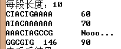

# 生物软件设计开发

## 当前内容

BWT算法

二阶BWT算法

结合hash的BWT算法的模糊匹配

## TODO

简化SA，checkpoint

排序算法

保存索引

1. 二阶

   跪求慢速的原因？（二阶字符比较慢？）

2. hash

   建表慢。。且搜索也不快。

   代码写的比较乱。

   check()函数。无法判断间隔的hash结果是否有重复。

   

​	hamming 距离。用edit距离来替换。（速度慢？